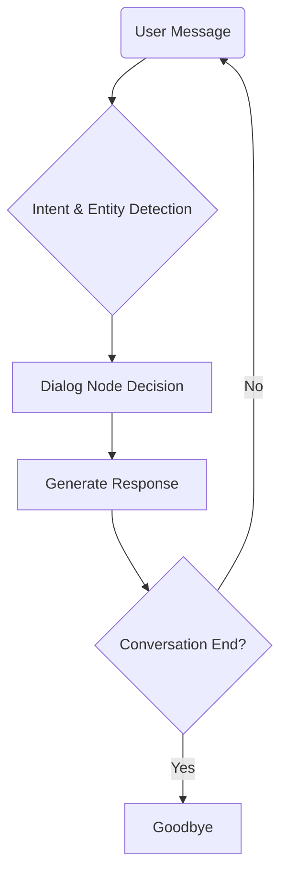

# 🧠 How Book Buddy Chatbot Works

This document explains the internal workflow of **Book Buddy**, a book‑recommendation chatbot built with **IBM Watson Assistant**.

---

## 1. User Interaction

Users start a conversation by typing messages such as:

- “Can you suggest a horror book?”  
- “Show me books by Agatha Christie.”  
- “Hello.”

---

## 2. Intent Detection

Watson Assistant classifies each message into an **intent**:

| Intent | Purpose | Example Utterances |
|--------|---------|--------------------|
| `#greet` | Greeting / start conversation | hello, hi |
| `#recommend_book` | Ask for book suggestions | suggest a book, recommend a novel |
| `#book_by_author` | Ask for books by a specific author | books by Dan Brown |
| `#goodbye` | End conversation | bye, goodbye |

---

## 3. Entity Recognition

A custom entity `@genre` captures the genre the user mentions:

- Mystery  
- Romance  
- Horror  
- Biography  
- Self‑help  
- Historical Fiction  

Example: “I want a **horror** book.” → `@genre:horror`.

---

## 4. Dialog Flow

The dialog tree routes the conversation:

1. **Welcome Node** (`#greet`) – replies with a friendly greeting.  
2. **Recommend by Genre** (`#recommend_book`) – checks `@genre` and replies with genre‑specific suggestions.  
3. **Books by Author** (`#book_by_author`) – extracts the author’s name and lists that author’s books.  
4. **Clarification Node** – if the genre or author is missing, asks follow‑up questions.  
5. **Goodbye Node** (`#goodbye`) – says farewell and ends context.

---

## 5. Multi‑turn Context

Watson Assistant stores context variables, e.g. the last genre requested, to keep multi‑turn dialogs natural.

```text
User: “Recommend me a book.”
Assistant: “Sure—what genre interests you?”
User: “Mystery.”
Assistant: “You might like *Gone Girl* by Gillian Flynn.”
```

---

## 6. Response Generation

Responses combine static text and dynamic inserts (book titles, authors) stored in dialog node responses or external services (optional).

---

## 7. Deployment

1. Open **Assistant > Integrations > Web Chat**.  
2. Copy the generated `<script>` tag.  
3. Paste it into your website’s HTML or SPA framework.  
4. Commit the embed code & this documentation to your GitHub repository.

---

## 8. Summary Flow



---

*Document created on 14 Jul 2025.*